# PlAterA - Restaurant Table Booking Application

PlAterA is a seamless reserve dining application made for a full-stack development mini project. It's a basic table booking application for restaurants and hotels. After booking confirmation, it generates a QR code and invoice too.

Project Link :- https://sujithputta02.github.io/Platera/

## 🍽️ Features

- **User Authentication**: Login and signup system for customers
- **Multi-Restaurant Support**: Book tables at various restaurants across different areas
- **Interactive Table Selection**: Visual seat selection with family and couple table options
- **Real-time Booking Management**: Track available slots and manage reservations
- **Responsive Design**: Modern, mobile-friendly interface with dark mode support
- **Booking Confirmation**: Generate QR codes and invoices for confirmed bookings
- **Location-based Restaurant Selection**: Organized by areas (JP Nagar, MG Road, Malleshwaram)

## 🏪 Mock Supported Restaurants

### JP Nagar
- The Rameshwaram Cafe (South Indian Cuisine)
- The Pump House (Continental Dishes)
- 1947 Restaurant (Italian Cuisine)

### MG Road
- Meghana Foods (Chinese Dishes)
- Indian Coffee House (Indian Thali)
- The White Room (Japanese Sushi)

### Malleshwaram
- Hallimane (American Burgers)
- Pizza Stop (Italian Pizza)
- Sattvam (Vegetarian Cuisine)

## 🚀 Getting Started

### Prerequisites
- Modern web browser (Chrome, Firefox, Safari, Edge)

### Installation

1. Clone the repository:
```bash
git clone <repository-url>
cd Platera-main
```

2. Open the project in your preferred code editor

3. Open `docs/index.html` in your web browser to start the application

## 🛠️ Technology Stack

- **Frontend**: HTML5, CSS3, JavaScript (ES6+)
- **Styling**: Custom CSS with responsive design
- **Fonts**: Google Fonts (League Spartan)
- **Icons**: Custom designed icons and images
- **No Backend**: Pure frontend application

## 📁 Project Structure

```
Platera-main/
├── docs/
│   ├── styles/          # CSS stylesheets
│   ├── javascript/      # JavaScript functionality
│   ├── websiteimages/   # Images and icons
│   └── *.html          # HTML pages
├── package.json         # Dependencies (for development tools only)
└── README.md           # Project documentation
```

## 🎯 Key Pages

- **Landing Page**: Welcome screen with app introduction
- **Login/Signup**: User authentication system
- **Dashboard**: Main interface with restaurant overview
- **Book a Table**: Restaurant selection and table booking
- **Menu Pages**: Individual restaurant menus and details
- **Confirmation**: Booking confirmation with QR code and invoice

## 🔧 Features in Detail

### Table Booking System
- Interactive table selection interface
- Support for family and couple tables
- Real-time availability tracking
- Booking validation and confirmation

### User Experience
- Responsive navigation bar
- Dark mode toggle
- Search functionality
- Loading animations
- User profile management

### Booking Management
- Date and time selection
- Customer information collection
- Booking ID generation
- Confirmation with QR codes and invoices

## 📱 Responsive Design

The application is fully responsive and works seamlessly across:
- Desktop computers
- Tablets
- Mobile devices
- Different screen resolutions

## 🎨 Design Features

- Modern, clean interface
- Consistent color scheme
- Professional typography
- Smooth animations and transitions
- Intuitive user navigation

## 🔒 Security Features

- Form validation
- Input sanitization
- Client-side data handling

## 🚧 Development Status

This is a mini project developed for educational purposes, demonstrating:
- Frontend development skills
- User interface design
- JavaScript functionality
- Responsive web design
- Project organization

## 📄 License

This project is created for educational purposes as part of a full-stack development course.

## 📸 Application Screenshots

### Landing page
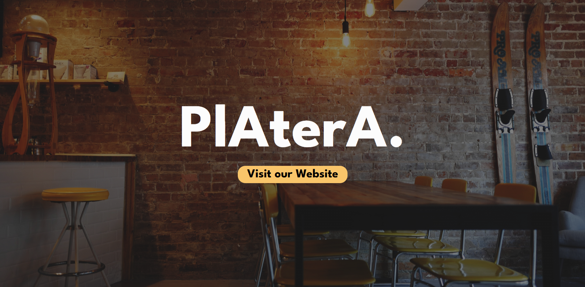

### Login Page
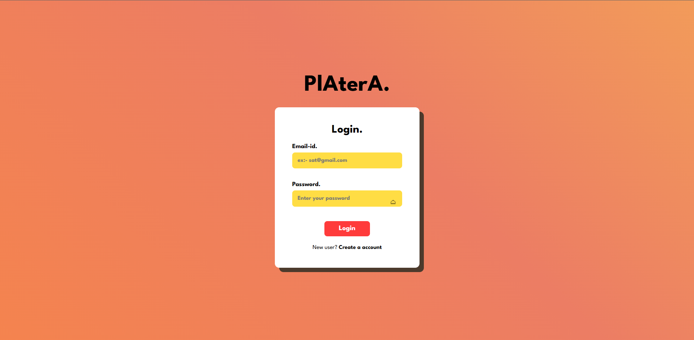

### Signup Page
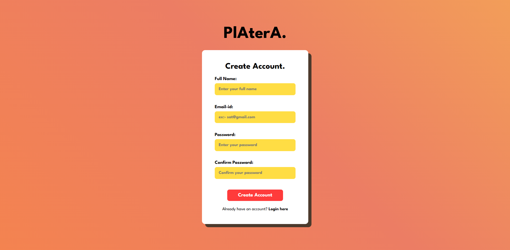

### Dashboard
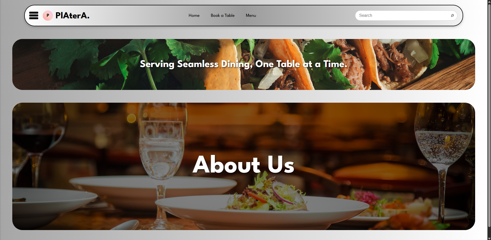

### Dashboard with Responsive Navbar
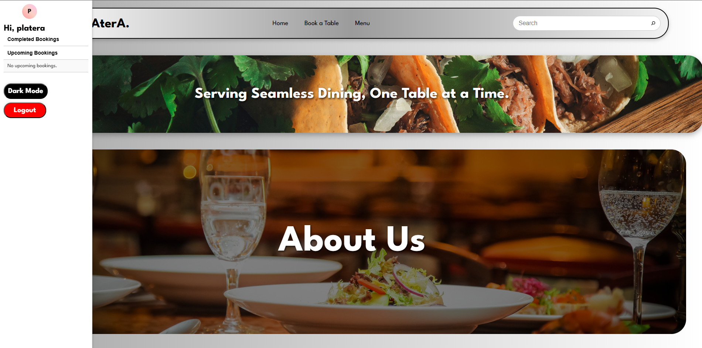

### Menu Page
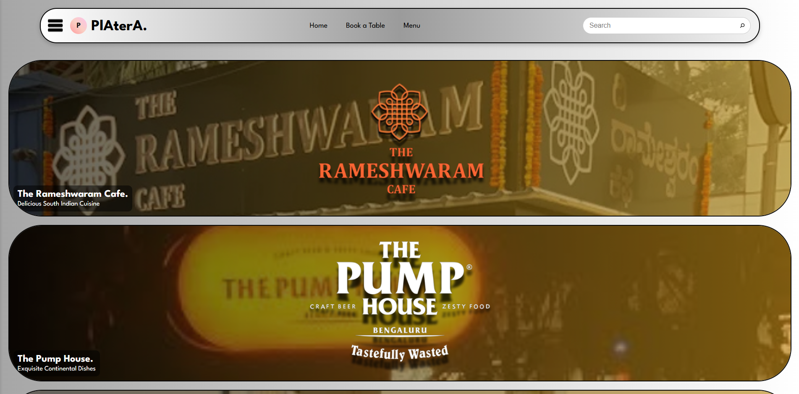

### Book a Table Page
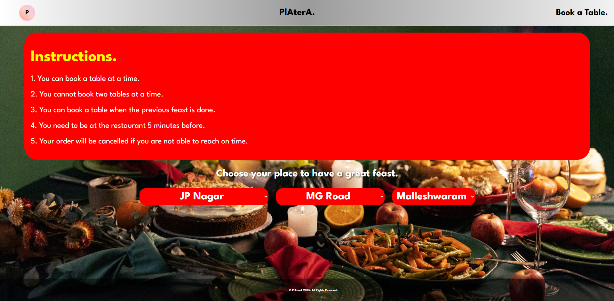

### Restaurant Page
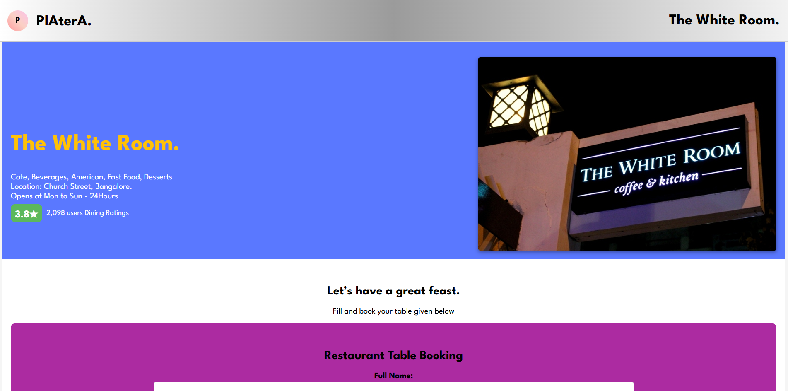

### Restaurant Booking Form
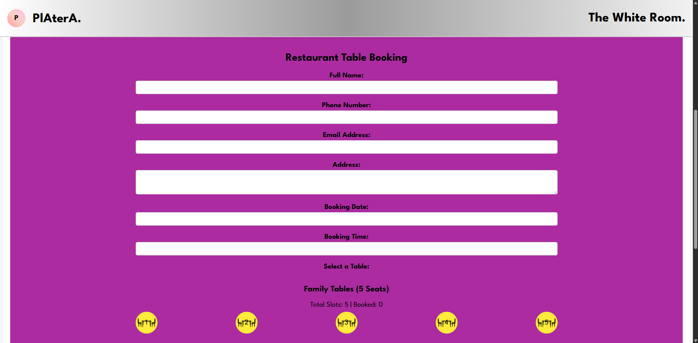

### Seat Selection
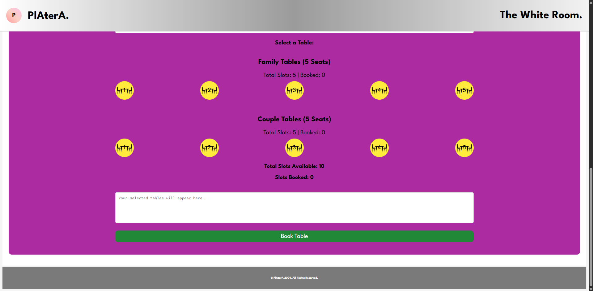

### Confirmation page
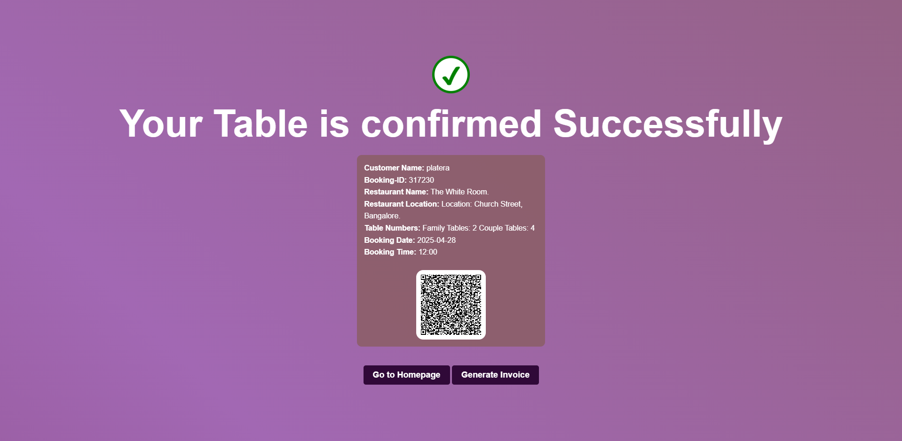

### Confirmation page with Invoice
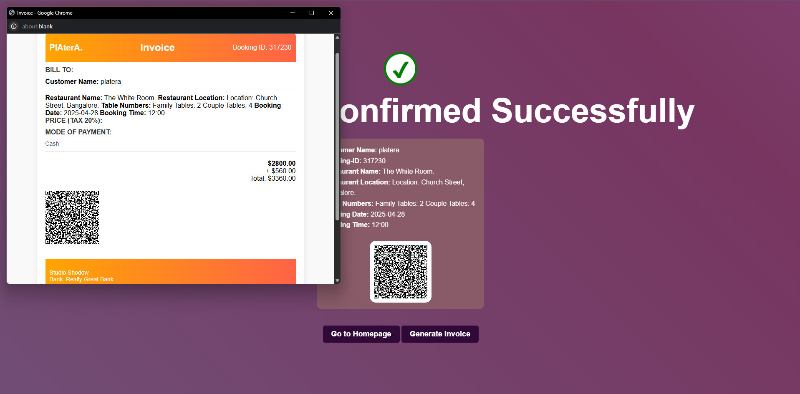

### Updating In the Upcoming Bookings with Time
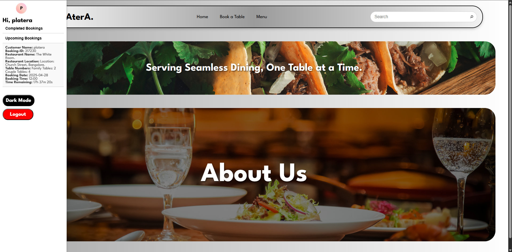

---

**Note**: This application is designed as a demonstration of frontend web development skills and may not include all production-ready features such as database integration, payment processing, or advanced security measures. 
