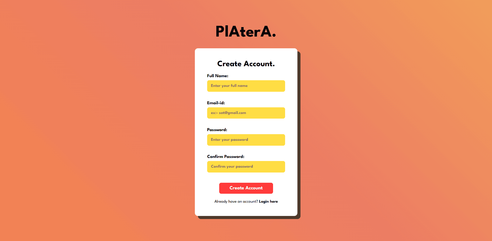
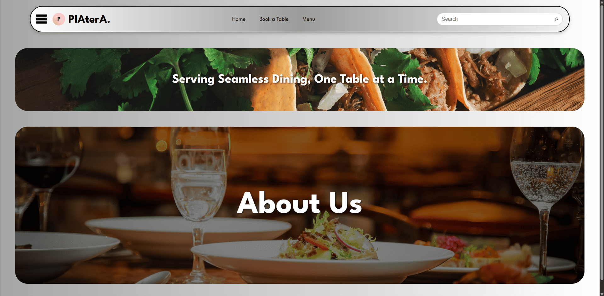
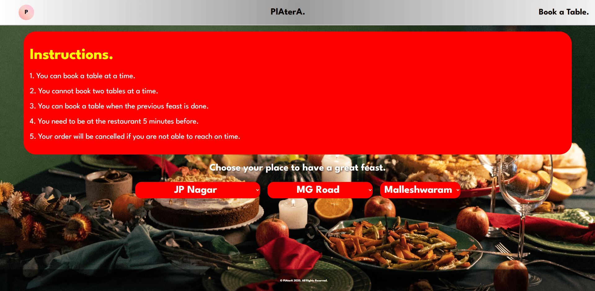

<h1>PlAterA</h1> 

PlAterA is a seamless reserve dining application made for a full-stack development mini project. It's a basic table booking application for restaurants and hotels. After booking confirmation, it generates a QR code and invoice too.

<b>Landing page</b>

<b>Login Page</b>

<b>Signup Page</b>

<b>Dashboard</b>

<b>Dashboard with Responsive Navbar</b>

<b>Menu Page</b>

<b>Book a Table Page</b>

<b>Restuarant Page</b>

<b>Restuarant Booking Form</b>

<b>Seat Selection</b>

<b>Confirmation page</b>

<b>Confirmation page with Invoice</b>

<b>Updating In the Upcoming Bookings with Time</b>

"This is my awesome project!" 
